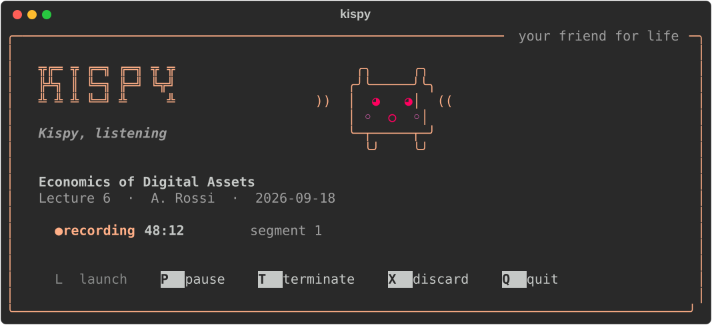
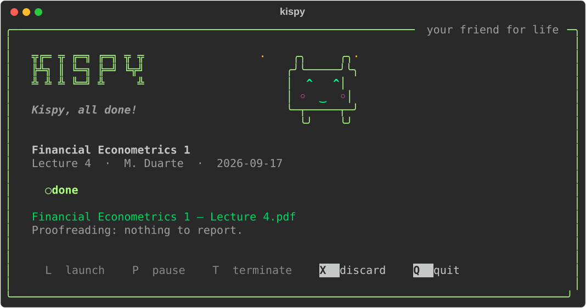
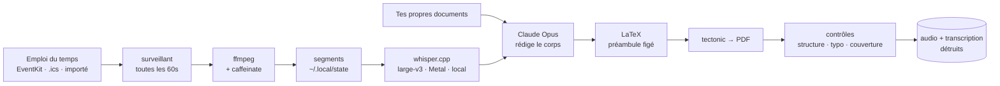

<h1 align="center">Kispy</h1>

<p align="center">
  <strong>Il enregistre tes cours. Il te rend le cours rédigé.</strong><br>
  <sub>Un petit agent discret pour macOS — ton emploi du temps, ton micro, ton abonnement Claude.</sub>
</p>

<p align="center">
  <a href="#installation">Installation</a> ·
  <a href="#réglage-cinq-questions-une-fois">Réglage</a> ·
  <a href="#au-quotidien-tu-ne-fais-rien">Au quotidien</a> ·
  <a href="#ce-qui-sort-de-ton-mac-et-ce-qui-est-détruit">Confidentialité</a> ·
  <a href="#si-ton-emploi-du-temps-nest-pas-dans-un-agenda">Pas d'agenda ?</a> ·
  <a href="README.md">🇬🇧 In English</a>
</p>

<p align="center">
  
</p>

---

## L'idée

Tu es dans un cours de trois heures. Tu écoutes, ou tu prends des notes ; faire
correctement les deux est un mythe. Kispy te retire le deuxième travail.

Il connaît ton emploi du temps, donc **à 9h45 il démarre tout seul**. Il
enregistre, en silence, sans rien afficher. Quand le cours est fini il s'arrête,
te demande si tu as quelque chose à ajouter — les slides, une photo du tableau,
les notes d'un camarade — puis, pendant que tu rentres, il transcrit la séance,
la rédige comme un vrai document de cours, compile un PDF et le range dans le bon
dossier.

Ensuite il détruit l'audio et la transcription.

Ce qui reste sur ton disque, c'est un `.tex` et un `.pdf`. Rien dedans ne
mentionne un enregistrement, une séance ou un intervenant. Ça se lit comme un
chapitre de manuel, parce que c'est là-dessus que tu veux réviser.

```
Documents/Cours/
└── Economics of Digital Assets/
    └── 2026-09-18 — Lecture 6/
        ├── Economics of Digital Assets — Lecture 6.pdf   ← 22 pages
        ├── Economics of Digital Assets — Lecture 6.tex
        └── slides-semaine6.pdf       ← ce que tu as déposé, intact
```

<p align="center">
  
</p>

---

## Ce qu'il te faut

| | |
|---|---|
| **Un Mac** | Apple Silicon de préférence — la transcription tourne sur le GPU. Un Mac Intel marche, plusieurs fois plus lentement. |
| **macOS 14 ou plus** | Kispy utilise AVFoundation, EventKit et Vision. |
| **Un abonnement Claude** | Pro ou Max. Les documents sont rédigés par Claude via le CLI Claude Code, sur *ton* compte. Kispy ne te demande jamais de clé d'API et ne stocke aucun identifiant. |
| **5 Go de libre environ** | dont 3,1 Go pour le modèle de reconnaissance vocale, qui reste définitivement sur ta machine. |
| **Homebrew** | [brew.sh](https://brew.sh) — l'installeur s'en sert pour ffmpeg, tectonic et poppler. |

Un agenda aide, mais n'est pas obligatoire : si ton école ne publie pas de
calendrier, Kispy sait **lire ton emploi du temps sur une capture d'écran**. Voir
[plus bas](#si-ton-emploi-du-temps-nest-pas-dans-un-agenda).

> **Une chose à régler d'abord.** Enregistrer un cours n'est pas toujours
> autorisé, et demande parfois l'accord de l'enseignant. Ça se passe entre toi et
> ton établissement ; Kispy ne connaît pas vos règles et ne les vérifiera pas à ta
> place.

---

## Installation

```bash
git clone https://github.com/Manceff/kispy.git
cd kispy
./install.sh
```

Tout atterrit dans ton dossier personnel. Rien n'a besoin de `sudo`, rien ne
touche au système, et `./uninstall.sh` enlève exactement ce qui a été posé.

L'installeur te demande quel modèle tu veux. Prends **large-v3** sauf si la place
disque est comptée : sur un Mac Apple Silicon il transcrit une heure de cours en
sept minutes environ, et sur un intervenant avec un accent la différence n'est pas
subtile.

<details>
<summary>Ce que fait réellement l'installeur</summary>

1. Vérifie que tu es sur macOS, avec les outils en ligne de commande Xcode et Homebrew.
2. `brew install` pour ce qui manque parmi **ffmpeg** (enregistre), **tectonic**
   (compile le PDF), **poppler** (permet à un modèle de lire une page scannée),
   **cmake**.
3. Trouve un Python ≥ 3.11 et construit un environnement virtuel privé dans
   `~/.local/lib/kispy/.venv`. Ton Python système n'est pas touché.
4. Compile deux petits utilitaires Swift : `kispy-cal` (lit l'app Calendrier via
   EventKit) et `kispy-ocr` (OCR hors ligne via Vision).
5. Clone et compile [whisper.cpp](https://github.com/ggml-org/whisper.cpp) avec
   Metal, et télécharge le modèle.
6. Écrit deux commandes dans `~/.local/bin` : `kispy` et `kispy-watch`.

</details>

---

## Réglage : cinq questions, une fois

```bash
kispy setup
```

Cinq minutes. Tu peux le relancer quand tu veux : chaque réponse est pré-remplie
avec ce qui est déjà configuré.

**1 — Connecter Claude.** Kispy rédige via le CLI Claude Code, connecté à ton
propre abonnement. S'il n'est pas installé l'assistant propose de l'installer ; si
tu n'es pas connecté il te dit de lancer `claude`, de taper `/login`, et de
revenir. Il ne te demande jamais de clé. *(Si tu préfères l'API, exporte toi-même
`ANTHROPIC_API_KEY` et mets `backend = "api"` dans la configuration.)*

**2 — Ton micro.** Il liste toutes les entrées que macOS voit et te demande
laquelle est celle de ton Mac. C'est plus important que ça n'en a l'air : les
*numéros* de périphérique AVFoundation se décalent dès qu'un iPhone ou des AirPods
apparaissent à proximité — c'est comme ça qu'un cours finit enregistré par un
téléphone au fond d'une poche. Kispy retient le **nom** et refuse de démarrer si
cette entrée précise a disparu. Il enregistre ensuite quatre secondes et te montre
le niveau, ce qui déclenche au passage l'autorisation micro de macOS.

**3 — Ton emploi du temps.** Trois voies, par ordre d'efficacité :

| | |
|---|---|
| **L'app Calendrier** | La meilleure. Pas de connexion, pas de jeton à rafraîchir, et un changement fait par ton école apparaît en quelques minutes. Tu coches les calendriers qui contiennent tes cours, pour que ton rendez-vous chez le dentiste ne soit pas pris pour un amphi. |
| **Une URL .ics** | Un lien publié par ton école, ou « l'adresse secrète au format iCal » de Google Agenda. Marche partout, mais Google met ses exports en cache pendant des heures — un cours ajouté ce matin peut n'apparaître que ce soir. |
| **Une capture d'écran** | Aucun agenda. [Voir plus bas.](#si-ton-emploi-du-temps-nest-pas-dans-un-agenda) |

Quel que soit ton choix, l'assistant t'affiche immédiatement les prochains jours
tels que Kispy les comprend. C'est la seule façon honnête de distinguer un emploi
du temps qui marche d'un emploi du temps qui en a l'air.

**4 — Où vont les documents.** Un dossier par matière, un dossier par séance
dedans. Si un dossier de matière existe déjà, Kispy range dedans au lieu d'en
créer un presque identique — et il note son choix, pour qu'un cours ne se promène
jamais entre deux dossiers d'une semaine sur l'autre.

**5 — Doit-il démarrer tout seul ?** Si tu dis oui, une tâche de fond regarde ton
emploi du temps une fois par minute et démarre au début du cours. Si tu dis non,
c'est toi qui pilotes avec `kispy`.

---

## Au quotidien, tu ne fais rien

| | |
|---|---|
| **9h45** | Le cours commence. Kispy démarre. Une notification te le dit, puis plus rien — pas de fenêtre, pas de son, pas d'icône dans la barre de menus. |
| **pendant** | Garde l'écran ouvert. Si le Mac s'endort le micro meurt avec lui ; Kispy s'en aperçoit en moins de deux minutes, repart sur un nouveau segment et te prévient. |
| **12h45** | Le cours finit. Kispy s'arrête tout seul. |
| **ensuite** | Une fenêtre : *as-tu des documents à ajouter ?* Dépose tes slides, une photo du tableau, les notes d'un camarade dans le dossier qui s'ouvre. PDF, DOCX, PPTX, images, écriture manuscrite — un scan est lu par un modèle, pas par un moteur d'OCR, ce qui fait la différence entre une décomposition de Cholesky correcte et `pupper diag / Lis cenique`. |
| **~15 min** | Transcription, puis le document, puis le PDF. Tu peux refermer l'écran : ça reprend au réveil. |
| **fini** | Une notification. L'audio et la transcription ont disparu. |

Ouvre l'app quand tu veux savoir où ça en est :

```bash
kispy
```

`L` lancer · `P` pause · `T` terminer · `X` supprimer · `Q` quitter.
Quitter ne l'arrête pas : la fenêtre est une vue, pas le programme.

---

## Les commandes

| | |
|---|---|
| `kispy` | Ouvre l'app. |
| `kispy setup` | Connecte Claude, le micro et l'emploi du temps. Relançable. |
| `kispy doctor` | Vérifie chaque maillon et dit lequel est cassé. |
| `kispy start` | Démarre maintenant. Il faut un cours à cette heure dans ton emploi du temps. |
| `kispy force "Blockchain"` | Enregistre un cours absent de l'agenda — ajouté tard, mal orthographié dans un flux partagé, ou simplement manquant. Le numéro de séance et le dossier viennent quand même du calendrier si le nom est reconnu. |
| `kispy pause` / `kispy stop` | Pause (`start` reprend sur un nouveau segment) / terminer et rédiger. |
| `kispy discard` | Jette la prise en cours. Un test, un faux départ. Ne touche jamais à un PDF déjà produit, ni à ce que tu as mis dans le dossier. |
| `kispy status` | Un écran de texte brut. Pratique en SSH. |
| `kispy timetable` | Importe ou revoit ton emploi du temps. |
| `kispy audit` | Vérifie que tes dossiers de cours sont en ordre : séances dans la mauvaise matière, numéros qui ne collent pas avec l'agenda, dossiers vides. Il signale, il ne déplace jamais rien. |
| `kispy auto off` / `on` | Fait taire le démarrage automatique un moment, et le rétablit. |

---

## Ce qui sort de ton Mac, et ce qui est détruit

À lire une fois, sérieusement.

**Reste sur ton Mac, toujours.** L'audio. La reconnaissance vocale tourne en local
via whisper.cpp sur ton GPU ; aucun fichier son n'est jamais envoyé à qui que ce
soit.

**Sort de ton Mac.** Le **texte** de la transcription, et le texte des documents
que tu as déposés dans le dossier de séance, sont envoyés à Claude — c'est ce qui
rédige ton document. Via ton propre abonnement, par le CLI Claude Code. Rien
d'autre n'est envoyé : ni ton agenda, ni tes noms de fichiers, ni tes autres cours.

**Détruit dès que le PDF existe.** Les segments audio, l'enregistrement
reconstitué et la transcription, écrasés puis supprimés. Si la chaîne échoue,
l'audio est au contraire *conservé* pour pouvoir recommencer — c'est le seul cas
où du son survit sur le disque.

**Jamais écrit.** Rien dans le `.tex` ni dans le `.pdf` ne fait référence à un
enregistrement, à une transcription, à une séance ou à un intervenant. Une
expression régulière le vérifie, et le document est réécrit si une trace passe.

**Identifiants.** Kispy ne demande jamais de mot de passe ni de clé d'API et n'en
stocke aucun. Il appelle `claude`, qui gère la connexion lui-même.

---

## Si ton emploi du temps n'est pas dans un agenda

Beaucoup d'écoles donnent un PDF, une page web à laquelle on ne peut pas
s'abonner, ou une photo dans une boucle WhatsApp. Kispy sait la lire.

```bash
kispy timetable
```

Donne-lui une **capture d'écran, une photo du planning, un PDF** — ou tape
simplement ta semaine comme tu la dirais :

```
Lundi 9h45-12h45     Blockchain, Rossi, salle S2
Mardi 14h-17h        Machine Learning
Jeudi 9h-12h         Économétrie avec Duarte, amphi B
```

Un modèle en fait une structure, Kispy t'affiche la semaine qu'il a comprise, et
n'enregistre qu'une fois que tu as confirmé. Les examens, les vacances et les
semaines de révision sont écartés au passage.

Ce qui est enregistré est un petit fichier lisible dans
`~/.config/kispy/timetable.json`, que tu peux ouvrir et corriger à la main —
`kispy timetable edit` fait exactement ça. Rien de magique là-dedans :

```json
{
  "term": { "start": "2026-09-15", "end": "2026-12-19" },
  "courses": [
    { "subject": "Economics of Digital Assets",
      "lecturer": "A. Rossi", "location": "S2",
      "weekday": "friday", "start": "09:45", "end": "12:45",
      "from": null, "to": null }
  ],
  "sessions": [
    { "subject": "Séminaire de mémoire", "date": "2026-10-03",
      "start": "10:00", "end": "12:00" }
  ]
}
```

`courses` se répète chaque semaine entre les dates du semestre ; `sessions` ce
sont les séances isolées ; `from` et `to` bornent un cours qui ne tourne que sur
une partie du semestre ; `except` prend une liste de dates à sauter.

---

## Quand quelque chose cloche

Commence par `kispy doctor`. Il teste chaque maillon et nomme celui qui est cassé.

| Symptôme | Ce qui se passe | Solution |
|---|---|---|
| Rien n'a été enregistré, le fichier est vide | Le terminal n'a pas l'autorisation micro | Réglages Système ▸ Confidentialité et sécurité ▸ Microphone, autorise ton terminal, puis `kispy test` |
| Il a enregistré par mon iPhone | Une entrée est apparue et a décalé les index | Déjà traité — Kispy sélectionne par nom. Si le nom lui-même a changé, relance `kispy setup` |
| Il s'est arrêté au milieu du cours | L'écran a été rabattu. Sur Apple Silicon ça force la veille, et `caffeinate` ne peut pas l'empêcher | Garde l'écran ouvert. Kispy repart tout seul en moins de deux minutes et te prévient, mais le trou est perdu |
| `timetable: macos: calendar access refused` | macOS n'a pas encore été sollicité, ou a été refusé | Réglages Système ▸ Confidentialité et sécurité ▸ Calendriers, autorise ton terminal, puis `kispy doctor`. L'autorisation est par application : autoriser Terminal n'autorise pas iTerm |
| Un cours est dans Google Agenda mais Kispy ne le voit pas | Un agenda partagé non coché pour la synchro | [calendar.google.com/calendar/syncselect](https://calendar.google.com/calendar/syncselect), coche-le, attends une minute |
| L'emploi du temps a plusieurs heures de retard | Tu es sur la voie `.ics` et Google met ses exports en cache | Ajoute plutôt l'agenda dans l'app Calendrier et relance `kispy setup` |
| `Claude: run claude once, then /login` | Le CLI n'est pas connecté | Lance `claude` dans un terminal, tape `/login` |
| Le document est plus maigre que le cours | En général une séance à moitié captée | `kispy status` liste ce que la relecture a trouvé, dont « short for the session » |
| Il a rangé un cours dans un nouveau dossier au lieu de l'existant | L'appariement par nom n'était pas sûr | Édite `~/.config/kispy/folders.toml` : cette table l'emporte sur tout |

Les mots mal entendus se corrigent à la source, pas après coup. Mets une ligne de
noms propres, d'acronymes et de jargon dans
`~/.config/kispy/glossary/_global.txt`, ou `<nom du cours>.txt` pour un seul
cours : ils sont donnés au modèle de reconnaissance comme contexte.

---

## Comment ça marche



Quelques décisions qui ne vont pas de soi, et leurs raisons :

- **Le modèle ne rédige jamais que le corps du document.** Le préambule est figé
  et éprouvé. La plupart des échecs de compilation LaTeX viennent d'un modèle qui
  invente un package ou un environnement ; ici il ne peut pas. Une tentative de
  réparation est prévue si le corps ne compile toujours pas.
- **L'enregistreur est volontairement bête.** `ffmpeg` qui écrit un fichier, rien
  d'autre. Aucun modèle n'est chargé et le GPU est au repos pendant que tu es en
  cours — la machine reste froide et la batterie tient.
- **Le travail vit dans un fichier JSON**, écrit atomiquement. Chaque étape
  vérifie si sa propre sortie existe déjà, donc un travail interrompu par un écran
  rabattu reprend où il s'était arrêté au lieu de tout refaire.
- **Le surveillant regarde la taille du fichier.** Un enregistrement qui ne
  produit plus de son a l'air parfaitement sain et ne donne rien. Si le segment
  cesse de grossir pendant deux minutes, Kispy relance la capture sur un nouveau
  segment et te le dit.
- **La relecture ne réécrit jamais.** Les contrôles de structure et de typographie
  sont déterministes — gratuits, instantanés, jamais faux. Le contrôle de
  couverture demande à un second modèle, moins cher, ce que le document a laissé
  de côté, et chaque remarque doit citer la matière mot pour mot sinon elle est
  jetée. Les remarques te sont présentées, et c'est tout.

Plus de détails dans [docs/how-it-works.md](docs/how-it-works.md).

---

## Les questions qu'on pose

**Ça marche si je referme mon portable ?** Pour l'enregistrement : non, le Mac
s'endort et le micro meurt. Pour tout ce qui vient après : oui, ça reprend au
réveil.

**Ça coûte combien ?** Rien de plus que l'abonnement Claude que tu as déjà. La
transcription est locale et gratuite. Un cours de trois heures représente quelques
minutes de modèle.

**Je peux l'utiliser en français, en allemand ?** Oui — la langue des cours se
règle au setup. Le document, lui, est rédigé en anglais ; change la première ligne
de `RULES` dans `kispy/synth.py` si tu veux autre chose.

**Je peux changer l'allure du PDF ?** C'est un seul fichier LaTeX :
`~/.local/lib/kispy/style/preamble.tex`. Garde les quatre encadrés et
`\kispyrunning`, le reste t'appartient.

**Ça marche avec Zoom ou des cours enregistrés ?** Il enregistre l'entrée que tu
as choisie. Pointe-le sur un périphérique agrégé ou une entrée de type loopback et
il enregistrera ce que ton Mac joue.

**Où je signale un problème ?** [Issues](https://github.com/Manceff/kispy/issues).

---

## Licence

MIT. Voir [LICENSE](LICENSE).

Construit sur [whisper.cpp](https://github.com/ggml-org/whisper.cpp),
[tectonic](https://tectonic-typesetting.github.io),
[rich](https://github.com/Textualize/rich) et
[Claude Code](https://claude.com/claude-code).
