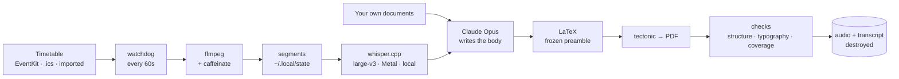

<h1 align="center">Kispy</h1>

<p align="center">
  <strong>It records your lectures. It hands you back the written course.</strong><br>
  <sub>A small, quiet agent for macOS — your timetable, your microphone, your Claude subscription.</sub>
</p>

<p align="center">
  <a href="#install">Install</a> ·
  <a href="#setup-five-questions-once">Setup</a> ·
  <a href="#every-day-you-do-nothing">Daily use</a> ·
  <a href="#what-leaves-your-mac-and-what-is-destroyed">Privacy</a> ·
  <a href="#if-your-timetable-is-not-in-a-calendar">No calendar?</a> ·
  <a href="README.fr.md">🇫🇷 En français</a>
</p>

<p align="center">
  
</p>

---

## The idea

You sit in a three-hour lecture. You either listen or you take notes; doing both
well is a myth. Kispy takes the second job off you.

It knows your timetable, so **at 9:45 it starts on its own**. It records, silently,
with nothing on screen. When the class is over it stops, asks whether you have
anything of your own to add — the slides, a photo of the board, a classmate's
notes — and then, while you walk home, it transcribes the session, writes it up as
a real course document, compiles a PDF and files it in the right folder.

Then it destroys the audio and the transcript.

What is left on your disk is a `.tex` and a `.pdf`. Nothing in them mentions a
recording, a session or a speaker. They read like a chapter of a textbook,
because that is what you want to revise from.

```
Documents/Courses/
└── Economics of Digital Assets/
    └── 2026-09-18 — Lecture 6/
        ├── Economics of Digital Assets — Lecture 6.pdf   ← 22 pages
        ├── Economics of Digital Assets — Lecture 6.tex
        └── slides-week6.pdf          ← what you dropped in yourself, untouched
```

<p align="center">
  
</p>

---

## What you need

| | |
|---|---|
| **A Mac** | Apple Silicon strongly preferred — transcription runs on the GPU. An Intel Mac works, several times slower. |
| **macOS 14 or later** | Kispy uses AVFoundation, EventKit and Vision. |
| **A Claude subscription** | Pro or Max. The documents are written by Claude through the Claude Code CLI, on *your* account. Kispy never asks you for an API key and never stores a credential. |
| **About 5 GB free** | 3.1 GB of that is the speech model, which lives on your machine for good. |
| **Homebrew** | [brew.sh](https://brew.sh) — the installer uses it for ffmpeg, tectonic and poppler. |

A timetable helps but is not required: if your school does not publish a calendar,
Kispy can **read your timetable off a screenshot**. See
[below](#if-your-timetable-is-not-in-a-calendar).

> **One thing to settle first.** Recording a class is not always allowed, and in
> some places it needs the lecturer's consent. That is between you and your
> institution; Kispy does not know your rules and will not check them for you.

---

## Install

```bash
git clone https://github.com/Manceff/kispy.git
cd kispy
./install.sh
```

Everything lands under your home directory. Nothing needs `sudo`, nothing touches
the system, and `./uninstall.sh` removes exactly what was put there.

The installer will ask which speech model you want. Take **large-v3** unless disk
space is tight: on an M-series Mac it transcribes an hour of lecture in about
seven minutes, and the difference on an accented lecturer is not subtle.

<details>
<summary>What the installer actually does</summary>

1. Checks you are on macOS and have the Xcode command line tools and Homebrew.
2. `brew install` for whatever is missing among **ffmpeg** (records), **tectonic**
   (compiles the PDF), **poppler** (lets a model read a scanned page), **cmake**.
3. Finds a Python ≥ 3.11 and builds a private virtual environment in
   `~/.local/lib/kispy/.venv`. Your system Python is left alone.
4. Compiles two small Swift helpers: `kispy-cal` (reads the Calendar app through
   EventKit) and `kispy-ocr` (offline OCR through Vision).
5. Clones and builds [whisper.cpp](https://github.com/ggml-org/whisper.cpp) with
   Metal, and downloads the speech model.
6. Writes two commands into `~/.local/bin`: `kispy` and `kispy-watch`.

</details>

---

## Setup: five questions, once

```bash
kispy setup
```

It takes about five minutes. You can re-run it whenever you like; every answer is
pre-filled with what is already configured.

**1 — Connect Claude.** Kispy writes through the Claude Code CLI, signed in to
your own subscription. If it is not installed the wizard offers to install it; if
you are not signed in it tells you to run `claude`, type `/login`, and come back.
It never asks you for a key. *(If you would rather use the API, export
`ANTHROPIC_API_KEY` yourself and set `backend = "api"` in the config.)*

**2 — Your microphone.** It lists every input macOS can see and asks which one is
your Mac's own. This matters more than it looks: AVFoundation device *numbers*
shift the moment an iPhone or a pair of AirPods appears nearby, which is how a
lecture gets recorded through a phone in someone's pocket. Kispy stores the
**name** and refuses to start if that exact input is gone. It then records four
seconds and shows you the level, which is also what triggers the macOS microphone
permission prompt.

**3 — Your timetable.** Three routes, in order of how well they work:

| | |
|---|---|
| **The Calendar app** | Best. No login, no token to refresh, and a change your school makes shows up within minutes. You tick which calendars hold your classes, so your dentist appointment is not mistaken for a lecture. |
| **A calendar URL (.ics)** | A link your school publishes, or Google Calendar's "secret address in iCal format". Works everywhere, but Google caches its exports for hours — a class added this morning may not appear until this evening. |
| **A screenshot** | No calendar at all. [See below.](#if-your-timetable-is-not-in-a-calendar) |

Whatever you choose, the wizard immediately shows you the next few days as Kispy
now understands them. That is the only honest way to tell a working timetable from
a plausible-looking one.

**4 — Where documents go.** One folder per subject, one folder per session inside
it. If a subject folder already exists, Kispy files into it rather than making a
near-duplicate — and it writes down the choice, so a course never drifts between
two folders from one week to the next.

**5 — Should it start by itself?** If you say yes, a background job looks at your
timetable once a minute and starts when a class begins. Say no and you drive it
yourself with `kispy`.

---

## Every day, you do nothing

| | |
|---|---|
| **09:45** | Your class begins. Kispy starts. A notification tells you so, and then nothing — no window, no sound, no icon in the menu bar. |
| **during** | Keep the lid open. If the Mac sleeps the microphone dies with it; Kispy notices within two minutes, restarts on a fresh segment and tells you. |
| **12:45** | The class ends. Kispy stops on its own. |
| **then** | A dialog: *anything of your own to add?* Drop your slides, a photo of the board, a classmate's notes into the folder it opens. PDF, DOCX, PPTX, images, handwriting — a scan is read by a model, not by an OCR engine, which is the difference between a correct Cholesky decomposition and `pupper diag / Lis cenique`. |
| **~15 min** | Transcription, then the document, then the PDF. You can close the lid; it resumes on wake. |
| **done** | A notification. The audio and the transcript are gone. |

Open the app whenever you want to see where it is:

```bash
kispy
```

`L` launch · `P` pause · `T` terminate · `X` discard · `Q` quit.
Quitting leaves it running; the window is a view, not the program.

---

## Commands

| | |
|---|---|
| `kispy` | Open the app. |
| `kispy setup` | Connect Claude, the microphone and your timetable. Re-runnable. |
| `kispy doctor` | Check every link in the chain and say which one is broken. |
| `kispy start` | Start recording now. Needs a class in your timetable at this hour. |
| `kispy force "Blockchain"` | Record a class the timetable does not know about — added late, mistyped in a shared feed, or simply missing. The lecture number and the folder still come from the calendar if the name is recognised. |
| `kispy pause` / `kispy stop` | Pause (`start` resumes on a new segment) / finish and write the document. |
| `kispy discard` | Throw the current take away. A test, a false start. Never touches a PDF that already exists, nor anything you put in the folder yourself. |
| `kispy status` | One screen of plain text. Useful over SSH. |
| `kispy timetable` | Import or review your timetable. |
| `kispy audit` | Check your course folders are tidy: sessions in the wrong subject, lecture numbers that disagree with the calendar, empty folders. Reports only — it never moves your files. |
| `kispy auto off` / `on` | Silence the automatic start for a while, and bring it back. |

---

## What leaves your Mac, and what is destroyed

Worth reading once, properly.

**Stays on your Mac, always.** The audio. Speech recognition runs locally through
whisper.cpp on your GPU; no sound file is ever uploaded, to anyone.

**Leaves your Mac.** The **text** of the transcript, and the text of any document
you dropped into the session folder, are sent to Claude — that is what writes your
document. This happens on your own subscription, through the Claude Code CLI.
Nothing else is sent: not your calendar, not your file names, not your other
courses.

**Destroyed as soon as the PDF exists.** The audio segments, the joined recording
and the transcript, overwritten and unlinked. If the pipeline fails, the audio is
*kept* instead, so you can run it again — that is the one case where sound
survives on disk.

**Never written down.** Nothing in the `.tex` or the `.pdf` refers to a recording,
a transcript, a session or a speaker. A regex checks for it and the document is
rewritten if a trace slips through.

**Credentials.** Kispy never asks for a password or an API key and never stores
one. It shells out to `claude`, which handles your sign-in itself.

---

## If your timetable is not in a calendar

Plenty of schools hand you a PDF, a web page you cannot subscribe to, or a photo
in a group chat. Kispy will read it.

```bash
kispy timetable
```

Point it at a **screenshot, a photo of a wall planner, a PDF** — or just type your
week in your own words:

```
Monday 9:45-12:45    Blockchain, Rossi, room S2
Tuesday 14:00-17:00  Machine Learning
Thursday 9-12        Econometrics with Duarte, amphi B
```

A model turns that into structure, Kispy shows you the week it understood, and
only saves it once you confirm. Exams, holidays and reading weeks are dropped on
the way in.

What it saves is a small readable file at `~/.config/kispy/timetable.json` that
you can open and fix by hand — `kispy timetable edit` does exactly that. Nothing
about this step is magic:

```json
{
  "term": { "start": "2026-09-15", "end": "2026-12-19" },
  "courses": [
    { "subject": "Economics of Digital Assets",
      "lecturer": "A. Rossi", "location": "S2",
      "weekday": "friday", "start": "09:45", "end": "12:45",
      "from": null, "to": null }
  ],
  "sessions": [
    { "subject": "Thesis seminar", "date": "2026-10-03",
      "start": "10:00", "end": "12:00" }
  ]
}
```

`courses` repeat every week between the term dates; `sessions` are one-offs; `from`
and `to` bound a course that only runs part of the term; `except` takes a list of
dates to skip.

---

## When something goes wrong

Start with `kispy doctor`. It checks every link and names the broken one.

| Symptom | What is happening | Fix |
|---|---|---|
| Nothing was recorded, the file is empty | The terminal has no microphone permission | System Settings ▸ Privacy & Security ▸ Microphone, allow your terminal, then `kispy test` |
| It recorded through my iPhone | An input appeared and shifted the device indices | Already handled — Kispy matches by name. If the name itself changed, re-run `kispy setup` |
| It stopped halfway through the lecture | The lid was closed. On Apple Silicon that forces sleep, and `caffeinate` cannot prevent it | Keep the lid open. Kispy restarts itself within two minutes and tells you, but the gap is lost |
| `timetable: macos: calendar access refused` | macOS has not been asked yet, or was refused | System Settings ▸ Privacy & Security ▸ Calendars, allow your terminal, then `kispy doctor`. Permission is per-application: granting Terminal does not grant iTerm |
| A class is in Google Calendar but Kispy cannot see it | A shared calendar that is not ticked for sync | [calendar.google.com/calendar/syncselect](https://calendar.google.com/calendar/syncselect), tick it, wait a minute |
| The timetable is hours out of date | You are on the `.ics` route and Google caches its exports | Add the calendar to the Calendar app instead and re-run `kispy setup` |
| `Claude: run claude once, then /login` | The CLI is not signed in | Run `claude` in a terminal, type `/login` |
| The document is thinner than the lecture was | Usually a half-captured session | `kispy status` lists what the proofreading found, including "short for the session" |
| It filed a course in a new folder instead of the existing one | Name matching was not confident | Edit `~/.config/kispy/folders.toml`: that table wins over everything |

Mishearings are worth fixing at the source rather than afterwards. Drop a line of
names, acronyms and jargon into `~/.config/kispy/glossary/_global.txt`, or
`<course name>.txt` for one course, and they are fed to the recogniser as context.

---

## How it works



A few decisions that are not obvious, and the reasons behind them:

- **The model only ever writes the body of the document.** The preamble is frozen
  and known-good. Most LaTeX compile failures come from a model inventing a
  package or an environment; it cannot, here. There is one repair attempt if the
  body still fails.
- **The recorder is deliberately stupid.** `ffmpeg` writing a file, nothing else.
  No model is loaded and the GPU is idle while you are in class — the laptop stays
  cold and the battery lasts.
- **The job lives in a JSON file**, written atomically. Every stage checks whether
  its own output already exists, so a job interrupted by a closing lid resumes
  where it stopped instead of starting over.
- **The watchdog watches the file size.** A recording that has stopped producing
  sound looks healthy and yields nothing. If the segment stops growing for two
  minutes, Kispy restarts the capture on a new segment and tells you.
- **The proofreading never rewrites.** Structural and typographic checks are
  deterministic — free, instant, never wrong. The coverage check asks a second,
  cheaper model what the document left out, and every finding must quote the
  material word for word or it is discarded. Findings are reported to you and that
  is all.

More in [docs/how-it-works.md](docs/how-it-works.md).

---

## Questions people ask

**Does it work if I close my laptop?** Recording: no — the Mac sleeps and the
microphone dies. Everything after the recording: yes, it resumes on wake.

**What does it cost?** Nothing beyond the Claude subscription you already have.
Transcription is local and free. A three-hour lecture is a few minutes of model
time.

**Can I use it in French, German, Spanish?** Yes — set the lecture language at
setup. The document itself is written in English; change the first line of `RULES`
in `kispy/synth.py` if you want otherwise.

**Can I change the look of the PDF?** It is one LaTeX file:
`~/.local/lib/kispy/style/preamble.tex`. Keep the four boxes and `\kispyrunning`
and the rest is yours.

**Does it work with Zoom or recorded lectures?** It records whatever input you
selected. Point it at an aggregate device or a loopback input and it will record
what your Mac is playing.

**Where do I report something?** [Issues](https://github.com/Manceff/kispy/issues).

---

## Licence

MIT. See [LICENSE](LICENSE).

Built on [whisper.cpp](https://github.com/ggml-org/whisper.cpp),
[tectonic](https://tectonic-typesetting.github.io),
[rich](https://github.com/Textualize/rich) and
[Claude Code](https://claude.com/claude-code).
